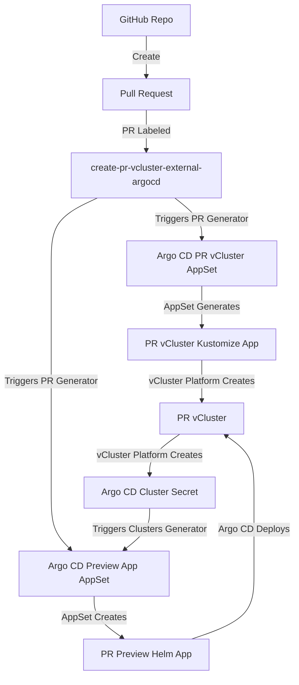

# vCluster GitHub Pull Request Preview Environment Using vCluster Platform and Shared Argo CD

```mermaid
---
config:
  look: classic
---
flowchart TD
    A["GitHub Repo"] -->| Create | B["Pull Request"] -->| PR Labeled | LPR[create-pr-vcluster-external-argocd] 
    LPR -->| Triggers PR Generator | C["Argo CD PR vCluster AppSet"]
    C -->| AppSet Generates | VA["PR vCluster Kustomize App"]
    VA --> | vCluster Platform Creates |V["PR vCluster"]
    V --> | vCluster Platform Creates |CS["Argo CD Cluster Secret"]
    LPR --> | Triggers PR Generator |AS["Argo CD Preview App AppSet"]
    CS --> | Triggers Clusters Generator |AS["Argo CD Preview App AppSet"]
    AS -->| AppSet Creates | APP["PR Preview Helm App"]
    APP --> | Argo CD Deploys | V
```
